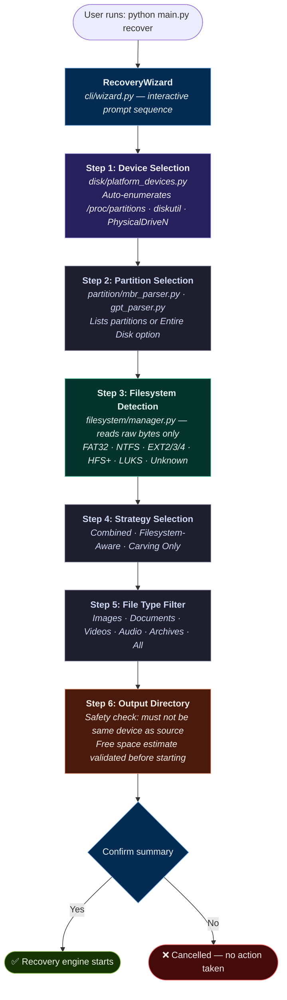
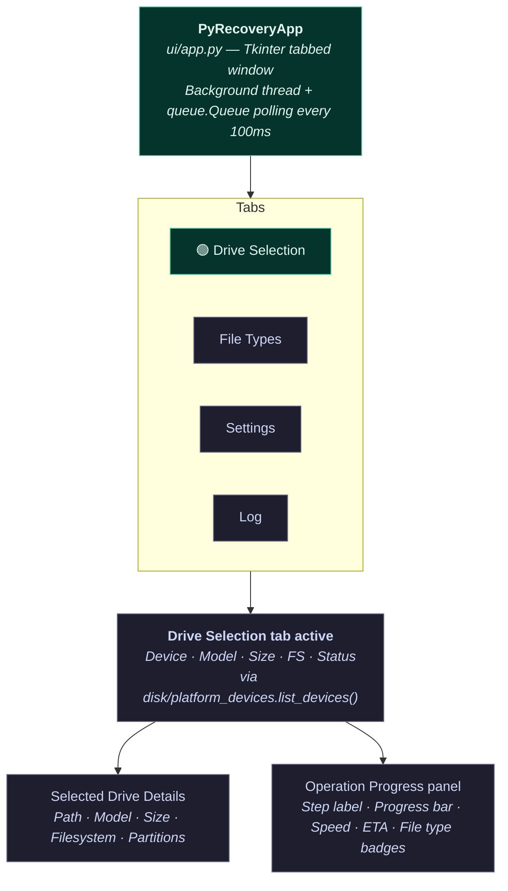
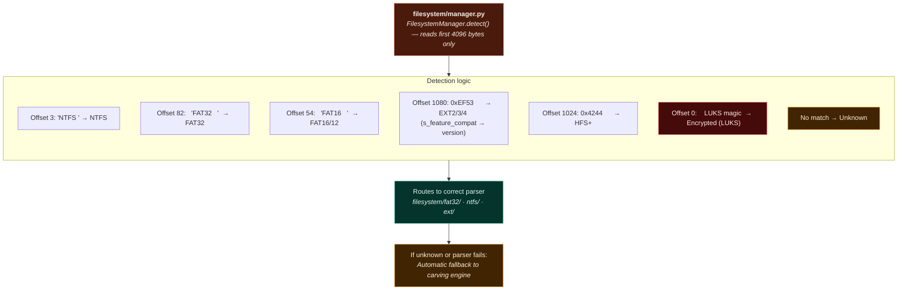
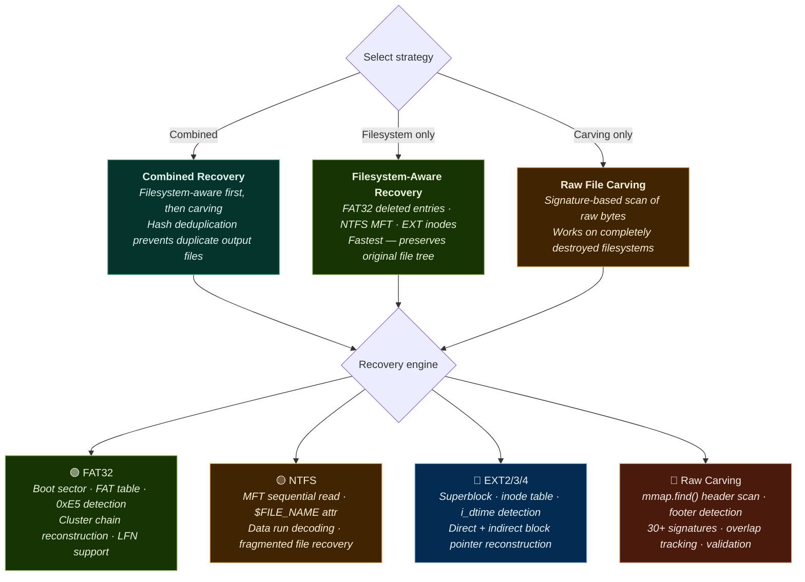
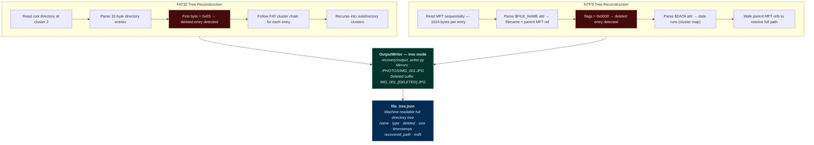
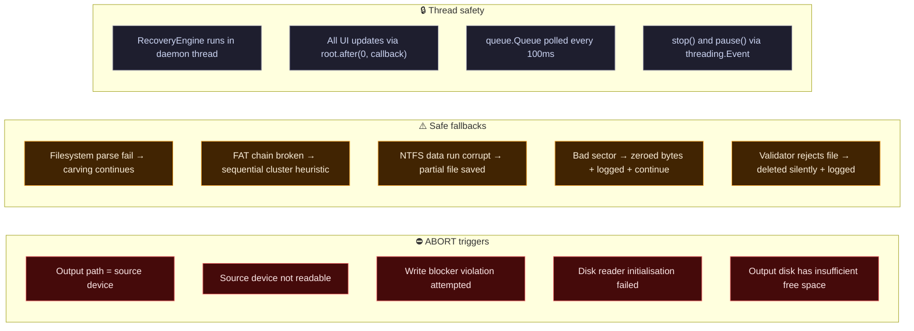
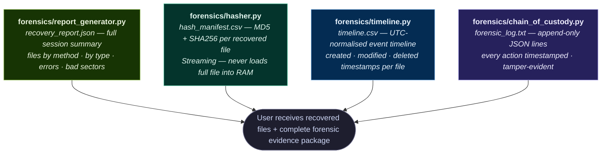
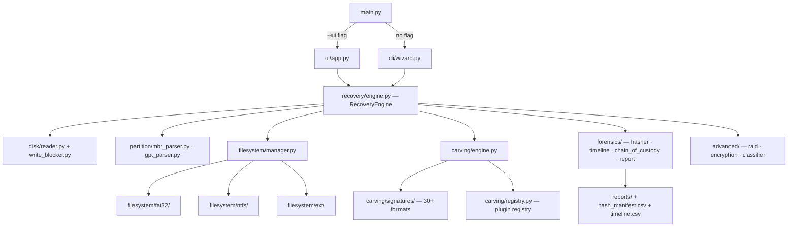

# PyRecovery

## Download and Quick Access

Link for downloading PyRecovery application:
_(Packaged EXE/binary builds — coming soon)_

PyRecovery is a Python-based file recovery and digital forensics application with:

- A desktop GUI (Tkinter) with modular tab-based interface
- An interactive CLI wizard for guided step-by-step recovery
- A 7-phase recovery engine: disk I/O → partitions → filesystems → carving → forensics → RAID → plugins
- Three recovery strategies: **Filesystem-Aware**, **Raw Carving**, **Combined**
- Filesystem support: **FAT32** (full), **NTFS** (MFT-based), **EXT2/3/4** (inode-based)
- File tree reconstruction — recovers the original folder and filename structure
- Structured JSON + CSV forensic reports with MD5/SHA256 hash manifest per session
- Plugin-based file signature system (30+ formats, extensible without core changes)

The project is designed to help users recover deleted or lost files from damaged, formatted, or corrupted storage media, and to produce traceable forensic records for audit workflows.

---

## ⚠️ Legal Disclaimer

> **This tool is intended for legitimate data recovery and digital forensics use only.**
> Use PyRecovery **only** on storage devices you own or have explicit written permission to examine.
> Unauthorized access to computer systems or storage media may violate local, national, and international law.
> The authors assume **no liability** for misuse of this software.
> By using this tool, you agree to use it responsibly and legally.

---

## Quick Start (60 Seconds)

Use this if you want to recover files quickly.

1. Clone the repository and install dependencies (see [Setup and Installation](#setup-and-installation)).
2. Run the interactive CLI wizard:
   ```bash
   python main.py recover
   ```
   Or launch the GUI:
   ```bash
   python main.py --ui
   ```
3. Select the source device from the automatically detected list.
4. Choose a partition or entire disk.
5. PyRecovery auto-detects the filesystem (FAT32 / NTFS / EXT / HFS+).
6. Select which file types to recover (images, documents, videos, archives, etc.).
7. Choose an output directory — **must be on a different device from the source**.
8. Recovery starts automatically. Watch live progress, speed, and file count.
9. Review the generated reports in the output folder when complete.

> **Important**: The source device is **always opened in read-only mode**. PyRecovery never writes to your source device under any circumstances.

---

## Table of Contents

- [Quick Start (60 Seconds)](#quick-start-60-seconds)
- [What This Project Does](#what-this-project-does)
- [Core Features](#core-features)
- [Recovery Strategies](#recovery-strategies)
- [Application Workflow](#application-workflow)
- [Architecture](#architecture)
- [Folder Structure](#folder-structure)
- [Module Reference](#module-reference)
- [Recovery Pipeline (7 Phases)](#recovery-pipeline-7-phases)
- [Supported File Formats](#supported-file-formats)
- [Output Structure](#output-structure)
- [Setup and Installation](#setup-and-installation)
- [Safety Notes](#safety-notes)
- [Performance](#performance)
- [Troubleshooting](#troubleshooting)

---

## What This Project Does

PyRecovery recovers deleted or lost files using a dual-strategy engine that automatically selects the best method for each device and filesystem:

- **Filesystem-aware recovery** — reads deleted directory entries directly from FAT32/NTFS/EXT metadata, reconstructing the original folder tree with filenames and timestamps preserved
- **Raw file carving** — scans raw bytes for known file header/footer signatures, recovering files even when the filesystem is completely destroyed
- **Partition scanning** — detects and recovers lost or deleted partitions from MBR and GPT tables
- **RAID reconstruction** — virtually assembles RAID 0/1 disk sets from multiple image files in memory
- **Encrypted volume detection** — identifies LUKS and BitLocker-encrypted regions and flags them clearly
- **Forensic audit logging** — immutable append-only log records every action with timestamps
- **Hash reporting** — MD5 + SHA256 generated for every recovered file, saved to a manifest CSV

---

## Core Features

- GUI-driven and CLI-wizard recovery — both interfaces share the same backend engine
- Interactive device discovery — auto-detects all connected drives on Linux, Windows, macOS
- Filesystem auto-detection from raw bytes — no guessing, no user input required
- File tree reconstruction — mirrors original `/PHOTOS/VACATION/IMG_001.JPG` paths in output
- Deleted file detection: FAT32 `0xE5` entries, NTFS MFT flag `0x0000`, EXT deleted inodes (`i_dtime != 0`)
- Plugin-based signature system — add new file formats without modifying core code
- `mmap`-based zero-copy reads + `bytes.find()` scanning — within 2–3x of C-based tools
- Thread-safe UI updates — background thread + queue polling every 100ms
- Output device safety check — blocks writing to the same physical device as the source
- Cross-platform support (Linux, Windows, macOS)

---

## Recovery Strategies

| Strategy | How It Works | Recovers Filenames | Recovers Folder Tree | Speed |
|---|---|---|---|---|
| **Filesystem-Aware** | Reads deleted entries from FAT32/NTFS/EXT metadata | ✅ Yes (partial for FAT32*) | ✅ Yes | Fast |
| **Raw Carving** | Scans raw bytes for known file headers and footers | ❌ No | ❌ No | Medium |
| **Combined** (default) | Both strategies simultaneously, deduplicated by hash | ✅ Yes where available | ✅ Yes where available | Thorough |

> *FAT32: the first character of a deleted filename is overwritten with `0xE5`. PyRecovery recovers the remaining characters and marks the first as `_` (e.g., `_MG_0001.JPG`).

> All strategies operate in **read-only mode**. The source device is never written to.

---

## Application Workflow

### 1 — CLI Wizard Flow



### 2 — GUI Main Interface



### 3 — Filesystem Detection (on device select)



> Filesystem detection uses **raw byte inspection only** — no OS mount, no filesystem driver, no modification to the source device.

### 4 — Recovery Strategy Selection



### 5 — Recovery Engine (7-Phase Pipeline)

```mermaid
flowchart TD
    P["<b>RecoveryEngine</b>(config, callbacks)<br><i>recovery/engine.py — orchestrates all phases<br>on_progress · on_file_found · on_log · on_complete · on_error</i>"] --> S1

    S1["Phase 1: <b>Disk Access Setup</b> ⛔ MANDATORY<br><i>disk/reader.py — mmap + chunked I/O, bad sector tracking<br>disk/write_blocker.py — raises WriteBlockerViolation on any write<br>Failure = ABORT</i>"] --> S2

    S2["Phase 2: <b>Partition Detection</b> ⛔ MANDATORY<br><i>partition/mbr_parser.py · gpt_parser.py<br>partition/scanner.py — heuristic lost partition search<br>Failure = ABORT</i>"] --> S3

    S3["Phase 3: <b>Filesystem Detection + Routing</b><br><i>filesystem/manager.py — raw byte inspection<br>Routes to FAT32 · NTFS · EXT parser or Unknown</i>"] --> S4

    S4["Phase 4: <b>Filesystem-Aware Recovery</b> ⚠️ OPTIONAL<br><i>Deleted entry scan · cluster / data-run reconstruction<br>File tree built with original paths and timestamps<br>Failure = warning + continue with carving</i>"] --> S5

    S5["Phase 5: <b>Raw File Carving</b> ⚠️ CONDITIONAL<br><i>carving/engine.py — mmap.find() hot loop<br>30+ signatures · 1MB chunks · 1KB overlap · interval tracking<br>Skipped if filesystem-aware covered all files</i>"] --> S6

    S6["Phase 6: <b>Validation + Deduplication</b> ⚠️ OPTIONAL<br><i>carving/validator.py — structural check per format<br>carving/deduplicator.py — MD5 first-64KB hash<br>Invalid or duplicate files deleted and logged</i>"] --> S7

    S7["Phase 7: <b>Output + Forensic Reporting</b> ⛔ MANDATORY<br><i>recovery/output_writer.py — tree mode + by-type mode<br>forensics/hasher.py · timeline.py · report_generator.py<br>forensics/chain_of_custody.py — append-only audit log<br>Failure = ABORT</i>"]

    style P fill:#042C53,stroke:#85B7EB,color:#E6F1FB
    style S1 fill:#26215C,stroke:#AFA9EC,color:#EEEDFE
    style S2 fill:#26215C,stroke:#AFA9EC,color:#EEEDFE
    style S3 fill:#04342C,stroke:#5DCAA5,color:#E1F5EE
    style S4 fill:#04342C,stroke:#5DCAA5,color:#E1F5EE
    style S5 fill:#4A1B0C,stroke:#F0997B,color:#FAECE7
    style S6 fill:#1e1e2e,stroke:#6c6c8a,color:#cdd6f4
    style S7 fill:#042C53,stroke:#85B7EB,color:#E6F1FB
```



> ⚠️ **Optional phases**: failure → warning logged → pipeline continues with next available strategy
> ⛔ **Mandatory phases**: failure → pipeline **ABORTS** with a clear error message

### 6 — File Tree Reconstruction



### 7 — Error and Safety Handling



> Forensic audit log is **always written**, even on failure. UI **never freezes**. Source device is **never modified**.

### 8 — Output and Reporting



---

## Architecture



### Dependency Rules

```
disk/        → imports nothing (pure I/O leaf)
partition/   → imports only disk/
carving/     → imports only disk/ and utils/
filesystem/  → imports disk/ and carving/ (carving used as fallback)
recovery/    → imports all of the above
forensics/   → imports only recovery/ and utils/
advanced/    → imports disk/ and carving/
cli/         → imports recovery/ and utils/
ui/          → imports recovery/ and utils/ only — never recovery internals
main.py      → imports cli/ and ui/ only
```

---

## Folder Structure

```text
pyrecovery/
├── main.py                        Entry point — routes to CLI wizard or GUI
├── requirements.txt               Python dependencies
├── README.md                      This file
│
├── disk/                          Layer 1: Safe raw disk access
│   ├── reader.py                  mmap + chunked I/O, bad sector handling
│   ├── imager.py                  Forensic disk imaging with SHA256 sidecar log
│   ├── bad_sector_map.py          Track and persist unreadable LBA addresses
│   ├── write_blocker.py           Raises WriteBlockerViolation on any write attempt
│   └── platform_devices.py       Cross-platform device enumeration
│
├── partition/                     Layer 2: Partition table parsing
│   ├── mbr_parser.py              MBR + 4 partition entries, byte-level struct
│   ├── gpt_parser.py              GPT header, GUIDs, partition entries, CRC32
│   ├── scanner.py                 Heuristic scan for lost/deleted partitions
│   └── recovery.py                Simulation-only partition table reconstruction
│
├── filesystem/                    Layer 3: Filesystem-aware parsing
│   ├── base.py                    Abstract FileSystem interface
│   ├── manager.py                 Auto-detect filesystem type from raw bytes
│   ├── fat32/
│   │   ├── boot_sector.py         Byte-level FAT32 boot sector struct
│   │   ├── fat_table.py           FAT table reader, cluster chain walker
│   │   ├── directory.py           32-byte directory entries, LFN, 0xE5 detection
│   │   ├── recovery.py            Deleted file extraction via cluster chain
│   │   └── tree_builder.py        Full recursive tree including deleted entries
│   ├── ntfs/
│   │   ├── boot_sector.py         NTFS boot sector, MFT cluster offset
│   │   ├── mft_parser.py          Sequential MFT entry reader, fixup application
│   │   ├── attributes.py          $STANDARD_INFO · $FILE_NAME · $DATA parsing
│   │   ├── data_runs.py           Variable-length data run decoder
│   │   ├── recovery.py            File reconstruction from data runs
│   │   └── tree_builder.py        Full path resolution via parent MFT references
│   └── ext/
│       ├── superblock.py          Superblock at offset 1024, 0xEF53 magic
│       ├── inode_parser.py        128/256-byte inode, i_dtime deleted detection
│       ├── block_groups.py        Block group descriptor table
│       └── recovery.py            File reconstruction from direct/indirect blocks
│
├── carving/                       Layer 4: Filesystem-independent file carving
│   ├── engine.py                  mmap.find() hot loop, chunk overlap, interval tracking
│   ├── chunk_reader.py            Buffered reads with 1KB boundary overlap
│   ├── base_signature.py          Abstract: header · footer · get_size · validate
│   ├── registry.py                Plugin auto-discovery, O(1) first-byte dispatch
│   ├── validator.py               Post-carve structural validation per format
│   ├── deduplicator.py            MD5-based duplicate suppression
│   └── signatures/
│       ├── images/                jpeg · png · gif · bmp · tiff · webp · psd · ico
│       ├── documents/             pdf · docx · rtf · html · xml
│       ├── archives/              zip · rar · sevenzip · gzip · bzip2
│       ├── media/                 mp4 · avi · mkv · mp3 · wav · flac · ogg
│       └── system/                elf · pe · sqlite · java_class
│
├── recovery/                      Layer 5: Unified recovery orchestrator
│   ├── engine.py                  RecoveryEngine — strategy router + callback bus
│   ├── strategy.py                Strategy pattern, RecoveryConfig dataclasses
│   ├── fragment_handler.py        Fragmented file heuristic reassembly
│   ├── directory_tree.py          DirectoryNode tree data structure
│   └── output_writer.py           Tree mode + by-type mode, .meta.json sidecars
│
├── forensics/                     Layer 6: Forensic integrity layer
│   ├── hasher.py                  MD5 + SHA256 streaming hasher (64KB blocks)
│   ├── timeline.py                UTC-normalised event timeline builder
│   ├── chain_of_custody.py        Append-only JSON-lines audit log
│   ├── report_generator.py        JSON + CSV reports + file_tree.json
│   └── evidence_packager.py       Package output as forensic evidence bundle
│
├── advanced/                      Layer 7: Advanced storage scenarios
│   ├── raid/
│   │   ├── detector.py            RAID 0/1 stripe-size heuristics
│   │   └── assembler.py           Virtual RAID 0 assembly — VirtualDisk in memory
│   ├── encryption/
│   │   ├── luks_detector.py       LUKS header detection + key slot info
│   │   └── bitlocker_detector.py  BitLocker metadata detection
│   └── classifier/
│       ├── entropy.py             Shannon entropy (detects encryption/compression)
│       └── content_classifier.py  Heuristic content-based file type classifier
│
├── cli/                           Interactive CLI interface
│   ├── wizard.py                  RecoveryWizard — 6-step guided prompt sequence
│   └── commands/
│       ├── scan.py                scan-disk · scan-partitions
│       ├── recover.py             recover-files · recover-partition
│       ├── carve.py               carve (filesystem-agnostic mode)
│       ├── analyze.py             analyze-disk · timeline · report
│       ├── image.py               create-image · verify-image
│       └── preview.py             preview-file (hex / text / thumbnail)
│
├── ui/                            Tkinter GUI interface
│   ├── app.py                     PyRecoveryApp — tabbed main window
│   ├── panels/
│   │   ├── drive_panel.py         Device list, details, scope, output path
│   │   ├── format_filter.py       File type checkboxes grouped by category
│   │   ├── progress_panel.py      Progress bar, speed, ETA, file-type badges
│   │   ├── file_tree.py           Recovered files Treeview with preview pane
│   │   └── preview_panel.py       Image thumbnail · text preview · hex dump
│   └── styles.py                  ttk.Style definitions, color constants
│
├── utils/                         Pure utility functions — no project imports
│   ├── hex_utils.py               Hex dump formatter (16 bytes/row)
│   ├── size_formatter.py          format_size() · format_speed() · format_eta()
│   ├── logger.py                  Structured logger with INFO/FOUND/WARN/ERROR tags
│   └── platform_utils.py         OS detection, admin check, path sanitization
│
├── plugins/                       Drop-in extension folder
│   └── README.md                  How to write a signature or filesystem plugin
│
└── tests/
    ├── fixtures/                  Synthetic disk images + ground_truth.json
    ├── test_disk_reader.py
    ├── test_carving_engine.py
    ├── test_fat32.py
    ├── test_ntfs_mft.py
    ├── test_ext_inodes.py
    ├── test_partition_parser.py
    ├── test_signatures.py
    └── test_recovery_pipeline.py
```

---

## Module Reference

### Core Modules

| Module | Purpose | Key Classes / Functions |
|---|---|---|
| `recovery/engine.py` | Unified recovery orchestrator | `RecoveryEngine`, `EngineCallbacks`, `RecoveryConfig` |
| `recovery/strategy.py` | Strategy routing | `RecoveryStrategy`, `choose_strategy()` |
| `recovery/output_writer.py` | Write recovered files | `OutputWriter.write_with_tree()`, `write_by_type()` |
| `disk/reader.py` | Raw read-only disk I/O | `DiskReader.read_at()`, `find()`, `iter_chunks()` |
| `disk/write_blocker.py` | Source protection | `WriteBlocker` — raises `WriteBlockerViolation` |
| `disk/platform_devices.py` | Device enumeration | `list_devices() → List[DeviceInfo]` |
| `filesystem/manager.py` | Filesystem auto-detection | `FilesystemManager.detect()`, `get_parser()` |
| `carving/engine.py` | Raw file carving | `CarvingEngine.scan()`, `_scan_with_mmap()` |
| `carving/registry.py` | Signature plugin registry | `SignatureRegistry.register()`, `get_by_first_byte()` |

### Filesystem Modules

| Module | Purpose | Key Classes / Functions |
|---|---|---|
| `filesystem/fat32/boot_sector.py` | FAT32 boot sector | `FAT32BootSector` — bytes_per_sector, root_cluster, fs_type |
| `filesystem/fat32/fat_table.py` | FAT table + cluster chains | `read_fat()`, `get_cluster_chain()` |
| `filesystem/fat32/directory.py` | Directory entries + LFN | `parse_directory_entries()`, `0xE5` deleted detection |
| `filesystem/fat32/tree_builder.py` | Full tree with deleted files | `FATTreeBuilder.build() → DirectoryNode` |
| `filesystem/ntfs/mft_parser.py` | MFT sequential reader | `read_all_mft_entries()`, `apply_fixup()` |
| `filesystem/ntfs/attributes.py` | MFT attribute parser | `parse_standard_info()`, `parse_file_name()`, `parse_data()` |
| `filesystem/ntfs/data_runs.py` | Data run decoder | `parse_data_runs(raw) → List[Tuple[start_cluster, length]]` |
| `filesystem/ntfs/tree_builder.py` | Path resolution via MFT refs | `NTFSTreeBuilder.build()`, `resolve_full_paths()` |
| `filesystem/ext/superblock.py` | EXT superblock | `EXTSuperblock` — magic 0xEF53, block_size, inode_size |
| `filesystem/ext/inode_parser.py` | Inode reader + deleted detection | `parse_inode()`, `i_dtime != 0 → deleted` |

### Forensics Modules

| Module | Purpose | Key Classes / Functions |
|---|---|---|
| `forensics/hasher.py` | MD5 + SHA256 per file | `Hasher.hash_file() → {md5, sha256}` |
| `forensics/chain_of_custody.py` | Immutable audit log | `ChainOfCustody.log(action, message)` — append-only |
| `forensics/timeline.py` | Event timeline | `TimelineBuilder.add_entry()`, `export_csv()` |
| `forensics/report_generator.py` | JSON + CSV reports | `generate_recovery_report()`, `generate_file_tree_json()` |

---

## Recovery Pipeline (7 Phases)

| # | Phase | Type | Module | Failure Behavior |
|---|---|---|---|---|
| 1 | Disk Access Setup | ⛔ Mandatory | `disk/reader.py` · `write_blocker.py` | ABORT — cannot open or protect source |
| 2 | Partition Detection | ⛔ Mandatory | `partition/mbr_parser.py` · `gpt_parser.py` | ABORT — cannot locate partition data |
| 3 | Filesystem Detection | Mandatory | `filesystem/manager.py` | Continue — unknown FS routes to carving |
| 4 | Filesystem-Aware Recovery | ⚠️ Optional | `filesystem/fat32/` · `ntfs/` · `ext/` | Warning + fallback to carving |
| 5 | Raw File Carving | ⚠️ Conditional | `carving/engine.py` | Warning + continue with files found so far |
| 6 | Validation + Deduplication | ⚠️ Optional | `carving/validator.py` · `deduplicator.py` | Invalid files deleted and logged |
| 7 | Output + Forensic Reporting | ⛔ Mandatory | `recovery/output_writer.py` · `forensics/` | ABORT — cannot write output |

---

## Supported File Formats

PyRecovery recovers **30+ file formats** out of the box, all extensible via the plugin system.

### Images

| Format | Extension | Magic Bytes | Size Method |
|---|---|---|---|
| JPEG | `.jpg` | `FF D8 FF` | Scan for footer `FF D9` |
| PNG | `.png` | `89 50 4E 47 0D 0A 1A 0A` | IEND chunk |
| GIF | `.gif` | `47 49 46 38 39 61` | Scan for footer `00 3B` |
| BMP | `.bmp` | `42 4D` | Size field at offset 2 (uint32 LE) |
| TIFF | `.tiff` | `49 49 2A 00` / `4D 4D 00 2A` | max_size cap |
| WebP | `.webp` | `52 49 46 46` + `57 45 42 50` at +8 | RIFF size at offset 4 |
| PSD | `.psd` | `38 42 50 53` | max_size cap |
| ICO | `.ico` | `00 00 01 00` | max_size cap |

### Documents

| Format | Extension | Magic Bytes | Size Method |
|---|---|---|---|
| PDF | `.pdf` | `25 50 44 46 2D` | Scan for footer `%%EOF` |
| DOCX / XLSX / PPTX | `.docx` | `50 4B 03 04` | Central directory end marker |
| RTF | `.rtf` | `7B 5C 72 74 66 31` | Scan for footer `7D` |
| HTML | `.html` | `3C 21 44 4F 43 54 59 50 45` | Scan for `</html>` |
| XML / SVG | `.xml` | `3C 3F 78 6D 6C` | Scan for closing `>` |

### Media

| Format | Extension | Magic Bytes | Size Method |
|---|---|---|---|
| MP4 / MOV | `.mp4` | `66 74 79 70` at offset 4 | MP4 box chain walk |
| AVI | `.avi` | `52 49 46 46` + `41 56 49 20` at +8 | RIFF size at offset 4 |
| MKV | `.mkv` | `1A 45 DF A3` | max_size cap |
| MP3 | `.mp3` | `49 44 33` (ID3) | ID3 size tag |
| WAV | `.wav` | `52 49 46 46` + `57 41 56 45` at +8 | RIFF size at offset 4 |
| FLAC | `.flac` | `66 4C 61 43` | max_size cap |
| OGG | `.ogg` | `4F 67 67 53` | max_size cap |

### Archives

| Format | Extension | Magic Bytes | Size Method |
|---|---|---|---|
| ZIP | `.zip` | `50 4B 03 04` | Central directory end record |
| RAR 4.x | `.rar` | `52 61 72 21 1A 07 00` | Scan for end-of-archive marker |
| RAR 5.x | `.rar` | `52 61 72 21 1A 07 01 00` | max_size cap |
| 7-Zip | `.7z` | `37 7A BC AF 27 1C` | max_size cap |
| GZIP | `.gz` | `1F 8B 08` | max_size cap |

### System / Database

| Format | Extension | Magic Bytes | Size Method |
|---|---|---|---|
| ELF binary | `.elf` | `7F 45 4C 46` | ELF header section offsets |
| PE executable | `.exe` / `.dll` | `4D 5A` | max_size cap |
| SQLite | `.sqlite` | `53 51 4C 69 74 65 20 66 6F 72 6D 61 74 20 33 00` | page_size × page_count |
| Java CLASS | `.class` | `CA FE BA BE` | max_size cap |

### Adding a New Format (Plugin Example)

Drop a single `.py` file into `plugins/` — no core code changes needed:

```python
# plugins/heic_signature.py
from carving.base_signature import BaseSignature

class HEICSignature(BaseSignature):
    name          = "HEIC Image"
    extension     = "heic"
    category      = "images"
    headers       = [b'ftyp' + b'heic']
    header_offset = 4
    min_size      = 1024
    max_size      = 50 * 1024 * 1024

    def get_size(self, data: bytes, offset: int) -> int | None:
        return None  # use max_size cap

    def validate(self, data: bytes) -> bool:
        return len(data) > self.min_size
```

The registry auto-discovers all `.py` files in `plugins/` at startup and logs every loaded signature.

---

## Output Structure

```text
recovered/
│
├── tree/                              Original directory structure (filesystem recovery)
│   ├── PHOTOS/
│   │   ├── VACATION/
│   │   │   ├── IMG_0001.JPG               live file
│   │   │   ├── IMG_0002_[DELETED].JPG     recovered deleted file
│   │   │   └── IMG_0003.JPG
│   │   └── FAMILY/
│   │       └── birthday_[DELETED].jpg
│   └── DOCUMENTS/
│       ├── report.pdf
│       └── invoice_[DELETED].docx
│
├── carved/                            Raw carving output (no filenames available)
│   ├── images/
│   │   ├── jpg/
│   │   │   ├── f000012345.jpg
│   │   │   └── f000012345.jpg.meta.json   offset · size · signature · hash · timestamp
│   │   └── png/
│   ├── documents/
│   │   └── pdf/
│   ├── media/
│   ├── archives/
│   └── partial/                       Files with no footer found — kept for manual review
│
└── reports/
    ├── recovery_report.json           Full session summary
    ├── file_tree.json                 Machine-readable directory tree
    ├── hash_manifest.csv              MD5 + SHA256 per recovered file
    ├── timeline.csv                   Chronological file event timeline
    └── forensic_log.txt               Append-only audit log (JSON lines)
```

### Sidecar Metadata File (`.meta.json`)

Every carved file gets a companion metadata file recording its full provenance:

```json
{
  "source_offset":       12845056,
  "source_offset_hex":   "0x00C40000",
  "size_bytes":          245760,
  "signature_matched":   "JPEG Image",
  "extraction_method":   "header_footer_scan",
  "footer_found":        true,
  "validation_passed":   true,
  "md5":                 "d41d8cd98f00b204e9800998ecf8427e",
  "sha256":              "e3b0c44298fc1c149afbf4c8996fb924...",
  "recovered_at":        "2026-04-28T10:22:05Z"
}
```

---

## Setup and Installation

### Prerequisites

| Requirement | Version | Notes |
|---|---|---|
| Python | 3.11+ | Required |
| pip | Latest | For dependencies |
| Root / Administrator | — | Required for physical devices only |

### 1 — Clone repository

```bash
git clone https://github.com/yourusername/pyrecovery.git
cd pyrecovery
```

### 2 — Create and activate virtual environment

**Windows (PowerShell)**
```powershell
python -m venv venv
.\venv\Scripts\activate
```

**Linux / macOS**
```bash
python3 -m venv venv
source venv/bin/activate
```

### 3 — Install dependencies

```bash
pip install -r requirements.txt
```

### 4 — Run the application

**Interactive CLI wizard (recommended for all users)**
```bash
python main.py recover
```

**Graphical UI**
```bash
python main.py --ui
```

**Direct carve command (advanced)**
```bash
python main.py carve --source /dev/sdb --formats jpg,pdf,zip --output ./recovered
```

**Recover from a disk image**
```bash
python main.py recover --source evidence.img --method all --output ./recovered
```

**Assemble RAID 0 then recover**
```bash
python main.py raid --disks disk1.img,disk2.img --stripe 64k --output assembled.img
python main.py recover --source assembled.img --output ./recovered
```

**Help**
```bash
python main.py --help
```

---

## Safety Notes

- The source device is opened in **read-only mode by default** and is never written to under any circumstances.
- The write-blocker (`disk/write_blocker.py`) intercepts and raises an exception on any write attempt to the source, logging the full call stack.
- The output directory is validated using `os.stat().st_dev` to ensure it **does not reside on the same physical device** as the source before recovery begins.
- Root / Administrator privileges are required only to open raw physical devices (e.g., `/dev/sdb`, `\\.\PhysicalDrive1`). Disk images (`.img`, `.dd`) work without elevation.
- On Linux, the tool checks `/proc/mounts` to verify the source partition is not actively mounted as writable before starting.
- Partition table reconstruction is **simulation-only by default** — nothing is written to the partition table without three explicit user confirmations and an automatic backup step.
- LUKS and BitLocker encrypted volumes are detected and flagged. PyRecovery does not attempt decryption under any circumstances.
- This tool provides operational recovery and forensic auditability. Overwritten data cannot be recovered by any software tool.

---

## Performance

PyRecovery is designed to close the performance gap between Python and C-based tools as much as the language allows:

| Optimization | Implementation | Expected Throughput |
|---|---|---|
| Baseline — no optimization | Pure Python byte loops | 2–10 MB/s |
| Larger chunk size | `f.read(4 * 1024 * 1024)` per iteration | 20–40 MB/s |
| `bytes.find()` for signatures | C-speed built-in string search | 60–100 MB/s |
| `mmap` + `mmap.find()` | Zero-copy, no seek syscall | 150–250 MB/s |
| `multiprocessing` (4 cores) | Parallel region scanning | 400–600 MB/s |


**Recommended chunk size by media type:**

| Media Type | Recommended Chunk Size |
|---|---|
| NVMe SSD | 4 MB |
| SATA SSD | 2 MB |
| HDD or USB drive | 512 KB |
| Disk image file | 4 MB (mmap used automatically) |

---

## Troubleshooting

| Problem | Solution |
|---|---|
| Permission denied on `/dev/sdX` or `PhysicalDriveN` | Run as `sudo` (Linux/macOS) or Administrator (Windows). Disk image files do not require elevation. |
| Device not listed in wizard or GUI | Click **Refresh Drives**. On Linux, check `/proc/partitions`. On Windows, the tool tries `PhysicalDrive0` through `PhysicalDrive9`. |
| Filesystem shows as **Unknown** | The filesystem may be damaged or unsupported (HFS+, exFAT). Choose **Raw Carving Only** — it works with no filesystem structure. |
| Recovered files are corrupt or incomplete | The data region was partially overwritten. Partial files are saved to `carved/partial/` for manual review. |
| `mmap` error on large physical device | `mmap` is automatically disabled for sources over 32 GB. Chunked reads are used transparently instead. |
| 0 deleted files found from FAT32 device | The `0xE5` first-byte detection may be broken. Run `python audit/step6_filesystem.py` to diagnose. |
| Recovery is very slow (under 10 MB/s) | The engine likely has byte-by-byte loops. Run `python audit/step8_performance.py` to identify the bottleneck. |
| UI freezes during scan | All Tkinter widget updates must go through `root.after()`. Check `ui/panels/progress_panel.py` for direct calls from the background thread. |
| Output written to source device warning | The `os.stat().st_dev` safety check blocked this. If it did not trigger, please report as a bug with device details. |
| LUKS / encrypted partition — no files recovered | Encrypted volumes cannot be recovered without the passphrase or key. PyRecovery detects and flags them in the report but does not attempt decryption. |
| RAID 0 image — nothing found | Assemble the RAID first using `python main.py raid --disks d1.img,d2.img --stripe 64k --output assembled.img`, then scan `assembled.img`. |
| FAT32 first character of filename shows as `_` | This is expected. FAT32 overwrites the first byte of a deleted filename with `0xE5`. PyRecovery restores the rest and marks the first character as `_`. |
| Drive listed but shows status **Encrypted** | LUKS or BitLocker detected. Decrypt the volume first using your OS tools, then run PyRecovery on the decrypted device or image. |

---

## Reference Links

- PhotoRec supported file formats: https://www.cgsecurity.org/wiki/File_Formats_Recovered_By_PhotoRec
- FAT32 specification: Microsoft FAT32 File System Specification, December 2000
- NTFS technical reference: Microsoft NTFS Documentation
- EXT4 on-disk layout: https://ext4.wiki.kernel.org/index.php/Ext4_Disk_Layout
- LUKS specification: https://gitlab.com/cryptsetup/cryptsetup