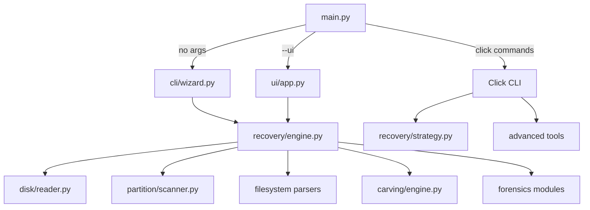

# PyRecovery

## Download and Quick Access

Link for downloading PyRecovery application:
_(Packaged EXE/binary builds - coming soon)_

PyRecovery is a Python-based file recovery and digital forensics toolkit with:

- Desktop GUI (Tkinter) with Drive Selection, File Types, Settings, and Log tabs
- Interactive CLI wizard (run `python main.py` with no arguments)
- Click-based CLI commands for carve, recover, scan, and analyze workflows
- Read-only disk access with a write blocker
- MBR/GPT partition scanning with filesystem probing
- Filesystem recovery for FAT32, NTFS, and EXT2/3/4
- Signature-based carving with plugins (30+ built-in formats)
- Forensic outputs: recovery report and hash manifests; optional chain of custody and evidence bundle via `analyze`
- Encryption detection for LUKS and BitLocker; entropy analysis and content classification
- RAID helpers in `advanced/raid` (programmatic use)

The project is designed to help users recover deleted or lost files from damaged, formatted, or corrupted storage media, and to produce traceable forensic records for audit workflows.

---

## ⚠️ Legal Disclaimer

This tool is intended for legitimate data recovery and digital forensics use only.
Use PyRecovery only on storage devices you own or have explicit written permission to examine.
Unauthorized access to computer systems or storage media may violate local, national, and international law.
The authors assume no liability for misuse of this software.
By using this tool, you agree to use it responsibly and legally.

---

## Quick Start (60 Seconds)

1. Create a virtual environment and install dependencies (see Setup and Installation).
2. Run the interactive CLI wizard:
   ```bash
   python main.py
   ```
   Or launch the GUI:
   ```bash
   python main.py --ui
   ```
3. Select the source device or disk image.
4. Choose a partition or the entire disk.
5. Pick a recovery strategy (filesystem, carving, or both).
6. Select an output directory (must be on a different device from the source for wizard/GUI).
7. Review outputs in the session directory once complete.

For direct commands and automation, see CLI Commands below.

---

## Table of Contents

- [Quick Start (60 Seconds)](#quick-start-60-seconds)
- [CLI Commands](#cli-commands)
- [GUI Overview](#gui-overview)
- [What This Project Does](#what-this-project-does)
- [Recovery Strategies](#recovery-strategies)
- [Notes and Current Limits](#notes-and-current-limits)
- [Architecture](#architecture)
- [Project Layout](#project-layout)
- [Output Structure](#output-structure)
- [Supported File Formats](#supported-file-formats)
- [Setup and Installation](#setup-and-installation)
- [Safety Notes](#safety-notes)
- [Performance Notes](#performance-notes)
- [Troubleshooting](#troubleshooting)
- [Reference Links](#reference-links)

---

## CLI Commands

Run `python main.py --help` for the full command list and options.

| Command | Description |
|---|---|
| `test-read` | Read and hex-dump specific sectors from a device or image. |
| `list-devices` | Enumerate detected storage devices. |
| `create-image` | Create a forensic disk image with a SHA256 hash. |
| `verify-image` | Verify an image against its stored hashlog. |
| `scan` | Scan partitions (MBR/GPT) and probe filesystems. |
| `recover` | Filesystem recovery with optional carving fallback. |
| `carve` | Signature-based carving on a full device/image. |
| `analyze` | End-to-end forensic analysis and reporting. |
| `hash` | Hash a file or directory (MD5 + SHA256). |
| `entropy` | Analyze entropy and classify content. |
| `detect-encryption` | Detect LUKS or BitLocker volumes. |
| `preview` | Hex/text preview at a specific offset. |

Examples:

```bash
python main.py scan evidence.img
python main.py recover evidence.img --output ./recovered --method auto
python main.py carve evidence.img --output ./recovered --chunk-size 2M
python main.py analyze evidence.img --output ./forensic_output --case-id CASE-001 --examiner "Analyst" --bundle --zip
python main.py detect-encryption evidence.img
python main.py preview evidence.img --offset 0 --length 256 --mode both
```

---

## GUI Overview

Launch with:

```bash
python main.py --ui
```

The GUI is a Tkinter notebook with four tabs:

- Drive Selection: device list, scope, output path, and recovery controls
- File Types: category selection (currently used for UI flow, not filtering)
- Settings: recovery options and safety toggles
- Log: live operational log output

The GUI uses the same recovery engine as the CLI wizard.

---

## What This Project Does

PyRecovery recovers deleted or lost files using two complementary approaches:

- Filesystem recovery: reads FAT32/NTFS/EXT metadata to reconstruct file content
- Signature carving: scans raw bytes for known file headers and footers

It also provides:

- Partition scanning (MBR/GPT) with filesystem probing
- Encryption detection for LUKS and BitLocker
- Forensic reporting (hash manifests, JSON reports, chain of custody)
- Entropy analysis and content classification

---

## Recovery Strategies

| Method | Behavior | Filenames | Folder Tree | Speed |
|---|---|---|---|---|
| `auto` (default) | Filesystem recovery plus carving when enabled | Yes (when available) | Yes (when available) | Fast to thorough |
| `filesystem` | Filesystem-only recovery | Yes | Yes | Fast |
| `carving` | Signature carving only | No | No | Medium |
| `all` | Filesystem recovery plus carving | Yes (when available) | Yes (when available) | Thorough |

Use `--method` on `recover` to pick a strategy.

---

## Notes and Current Limits

- HFS+ is detected but not fully parsed; recovery is FAT32/NTFS/EXT only.
- File type selection in the wizard/GUI is currently informational; carving scans all registered signatures.
- RAID helpers are available in `advanced/raid` but do not have a CLI entry point yet.
- The `carve` command always scans the full source.

---

## Architecture



---

## Project Layout

```text
.
├── main.py
├── requirements.txt
├── README.md
├── advanced/
│   ├── classifier/
│   ├── encryption/
│   └── raid/
├── audit/
├── carving/
│   ├── base_signature.py
│   ├── chunk_reader.py
│   ├── deduplicator.py
│   ├── engine.py
│   ├── registry.py
│   ├── validator.py
│   └── signatures/
├── cli/
│   └── wizard.py
├── disk/
│   ├── bad_sector_map.py
│   ├── imager.py
│   ├── platform_devices.py
│   ├── reader.py
│   └── write_blocker.py
├── filesystem/
│   ├── ext.py
│   ├── fat32/
│   │   └── tree_builder.py
│   ├── manager.py
│   ├── models.py
│   └── ntfs/
│       └── tree_builder.py
├── forensics/
│   ├── chain_of_custody.py
│   ├── evidence_packager.py
│   ├── hasher.py
│   ├── report_generator.py
│   └── timeline.py
├── partition/
│   ├── gpt.py
│   ├── mbr.py
│   └── scanner.py
├── recovery/
│   ├── directory_tree.py
│   ├── engine.py
│   ├── fragment_handler.py
│   ├── output_writer.py
│   └── strategy.py
├── ui/
│   ├── app.py
│   └── panels/
│       ├── drive_panel.py
│       ├── filetype_panel.py
│       ├── log_panel.py
│       ├── progress_panel.py
│       └── settings_panel.py
├── utils/
│   ├── hex_utils.py
│   ├── logger.py
│   ├── platform_utils.py
│   └── size_formatter.py
└── plugins/
    ├── heic_signature.py
    └── README.md
```

---

## Output Structure

`recover` (CLI) creates a timestamped session directory:

```text
recovered/
└── 20260429_210938/
    ├── partition_1_ntfs/
    │   └── Users/...
    ├── partition_2_fat32/
    │   └── DCIM/...
    ├── carved/
    │   ├── images/
    │   │   └── jpg/
    │   │       ├── f000012345.jpg
    │   │       └── f000012345.jpg.meta.json
    │   └── documents/
    └── manifest.json
```

The wizard/GUI engine (RecoveryEngine) writes the same layout plus hashes and a report:

```text
recovered/
└── recovery_20260429_210938/
    ├── partition_1_ntfs/
    ├── carved/
    ├── manifest.json
    ├── hash_manifest.csv
    ├── hash_manifest.json
    └── recovery_report.json
```

`carve` writes only carved output (no filesystem recovery):

```text
recovered/
└── 20260429_210938/
    └── images/jpg/f000012345.jpg
```

`analyze` produces a forensic output directory:

```text
forensic_output/
├── chain_of_custody.jsonl
├── forensic_report.json
├── hash_manifest.csv
├── hash_manifest.json
├── timeline.csv
├── timeline.json
└── recovered/
    └── 20260429_210938/
```

---

## Supported File Formats

PyRecovery recovers 30+ formats out of the box and supports drop-in plugins.

Images: JPEG, PNG, GIF, BMP, TIFF, WebP, PSD, ICO
Documents: PDF, DOCX/XLSX/PPTX, RTF, XML, HTML
Archives: ZIP, RAR, 7z, GZIP
Media: MP4, AVI, MP3, WAV, MKV, FLAC, OGG
System/DB: ELF, PE/EXE, SQLite, Java class, LUKS header, VMDK

### Adding a New Format (Plugin Example)

Drop a single `.py` file into `plugins/`:

```python
# plugins/heic_signature.py
from carving.base_signature import BaseSignature

class HEICSignature(BaseSignature):
    name = "HEIC Image"
    extension = "heic"
    category = "images"
    headers = [b"ftyp" + b"heic"]
    header_offset = 4
    min_size = 1024
    max_size = 50 * 1024 * 1024

    def get_size(self, data: bytes, offset: int) -> int | None:
        return None  # use max_size cap

    def validate(self, data: bytes) -> bool:
        return len(data) > self.min_size
```

---

## Setup and Installation

### Prerequisites

| Requirement | Version | Notes |
|---|---|---|
| Python | 3.11+ | Required |
| pip | Latest | For dependencies |
| Root/Administrator | - | Required for physical devices only |

### 1 - Clone repository

```bash
git clone https://github.com/yourusername/pyrecovery.git
cd pyrecovery
```

### 2 - Create and activate virtual environment

Windows (PowerShell)
```powershell
python -m venv venv
.\venv\Scripts\activate
```

Linux/macOS
```bash
python3 -m venv venv
source venv/bin/activate
```

### 3 - Install dependencies

```bash
pip install -r requirements.txt
```

### 4 - Run the application

Interactive CLI wizard
```bash
python main.py
```

Graphical UI
```bash
python main.py --ui
```

Help
```bash
python main.py --help
```

---

## Safety Notes

- The source device is opened in read-only mode and never written to.
- The write blocker intercepts any write attempts to the source.
- The wizard and GUI validate that the output directory is not on the source device.
- Physical devices require elevated privileges; disk images do not.
- Partition tables are never modified by this tool.
- Encrypted volumes are detected and reported but never decrypted.

---

## Performance Notes

- `DiskReader` uses mmap for image files under 32 GB; larger sources use buffered reads.
- The carving engine scans in 1 MB chunks with a 1 KB overlap to avoid boundary misses.
- `bytes.find()` is used for signature searching to keep scanning fast.

---

## Troubleshooting

| Problem | Solution |
|---|---|
| Permission denied on `/dev/sdX` or `PhysicalDriveN` | Run as `sudo` (Linux/macOS) or Administrator (Windows). Disk image files do not require elevation. |
| Device not listed in wizard or GUI | Click Refresh Drives. On Windows, try Browse Image File for `.img`/`.dd`. |
| Filesystem shows as Unknown | The filesystem may be damaged or unsupported. Use carving-only recovery. |
| Recovered files are corrupt or incomplete | The data region was partially overwritten. Partial files remain in the carved output. |
| Recovery is very slow | Run `python audit/step8_performance.py` to profile the bottleneck. |
| 0 deleted files found from FAT32 | Run `python audit/step6_filesystem.py` to validate FAT parsing. |
| UI freezes during scan | UI updates must use `root.after()`; review `ui/panels/progress_panel.py`. |
| FAT32 first character shows `_` | Expected behavior for deleted entries (0xE5 placeholder). |
| Drive shows status Encrypted | LUKS or BitLocker detected. Decrypt with OS tools before recovery. |

---

## Reference Links

- PhotoRec supported file formats: https://www.cgsecurity.org/wiki/File_Formats_Recovered_By_PhotoRec
- FAT32 specification: Microsoft FAT32 File System Specification, December 2000
- NTFS technical reference: Microsoft NTFS Documentation
- EXT4 on-disk layout: https://ext4.wiki.kernel.org/index.php/Ext4_Disk_Layout
- LUKS specification: https://gitlab.com/cryptsetup/cryptsetup
